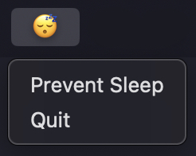
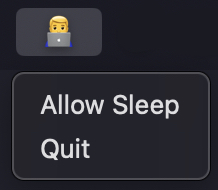

# Idler

A lightweight macOS application that prevents system and display sleep through system tray integration.

## Preview

**Inactive State (Sleep Allowed)**




**Active State (Sleep Prevented)**



## Features

- Prevents system sleep and display sleep
- System tray integration with toggle functionality
- Simulates user activity to maintain active state
- Clean exit handling with proper resource cleanup

## Requirements

- macOS (darwin)
- Go 1.24+
- CGO enabled
- Xcode Command Line Tools (for system frameworks)

## Installation

### From Source

```bash
git clone https://github.com/alexrett/idler.git
cd idler
make build
```

The build process creates a macOS application bundle and copies it to `~/Applications/`.

### Manual Build

```bash
GOOS=darwin GOARCH=amd64 CGO_ENABLED=1 go build -o idler .
```

## Usage

1. Launch the application from Applications folder
2. The app runs in the system tray with a sleep icon
3. Click the tray icon and select "Prevent Sleep" to activate
4. The icon changes to indicate active state
5. Select "Allow Sleep" to deactivate or "Quit" to exit

When active, the application:
- Creates IOKit power management assertions
- Simulates user activity every 30 seconds
- Performs minimal mouse movements to prevent idle detection

## Technical Details

The application uses:
- IOKit Power Management API for sleep prevention
- Core Graphics for user activity simulation
- System tray integration via getlantern/systray
- CGO bindings for macOS system frameworks

## Dependencies

- `github.com/getlantern/systray` - Cross-platform system tray library

## Building

The included Makefile handles:
- Cross-compilation for macOS
- Application bundle creation
- Icon and Info.plist integration
- Installation to Applications folder

## License

This project is provided as-is without warranty.
